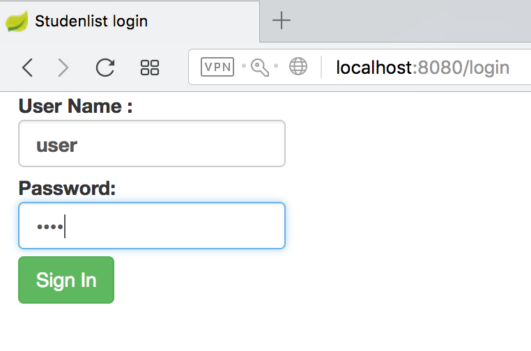
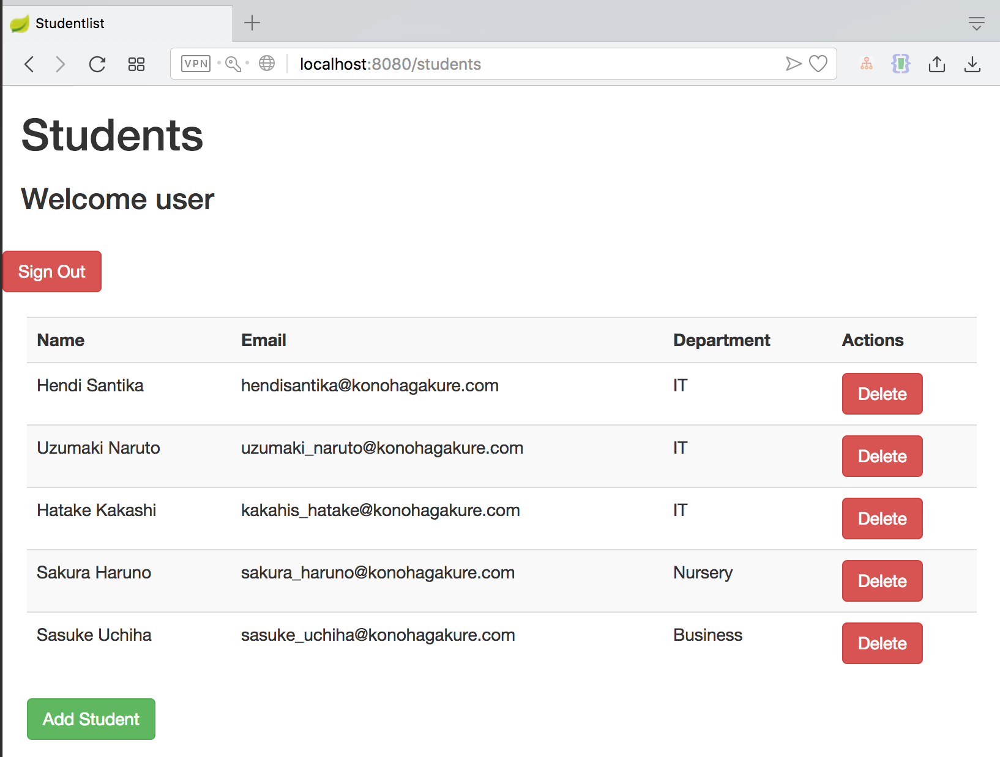
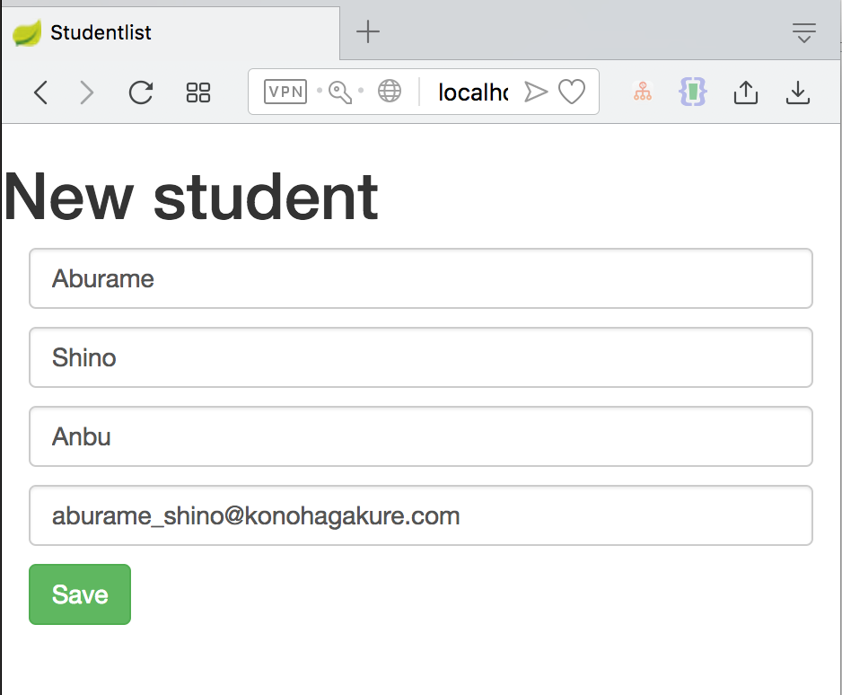

# StudentList
Simple CRUD application made with Spring Boot and secured with Spring Security

- Spring Boot
- Spring Security
- Thymeleaf
- H2 database
- Bootstrap

Usage (with eclipse):

1.) Clone the project

2.) Eclipse: File -> Import -> Maven -> Existing Maven Projects

3.) Run

4.) Navigate to localhost:8080

or run this project by copy this command into your terminal :

`mvn clean spring-boot:run`

Username & password : `user/user`

Login User Page:

List User Page

Add New User Page

